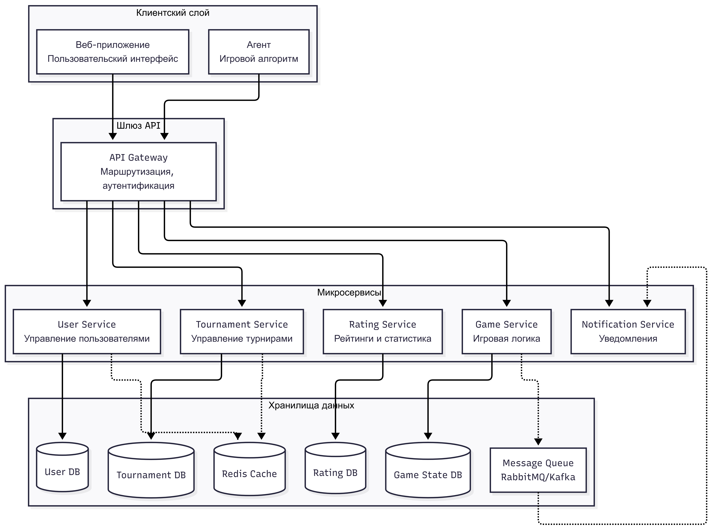
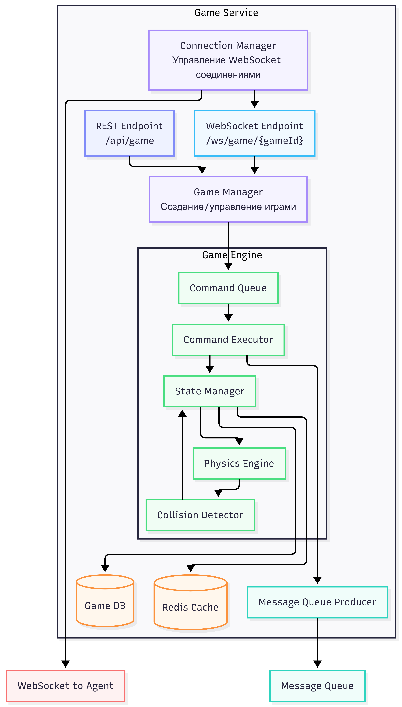
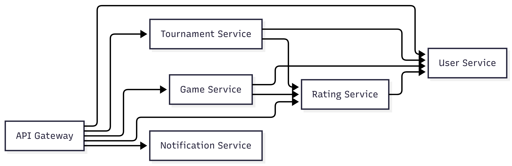
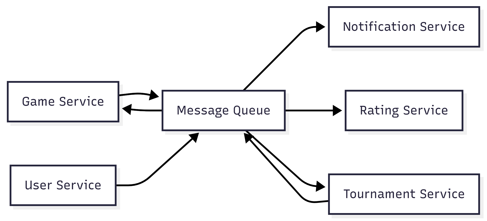
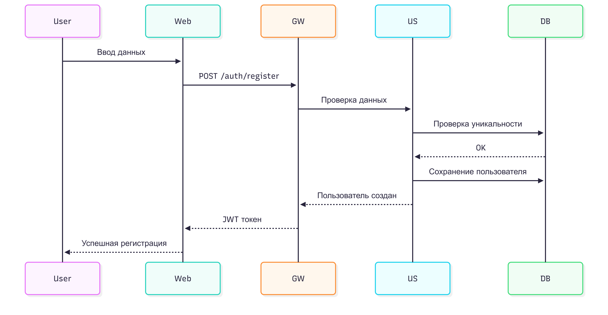
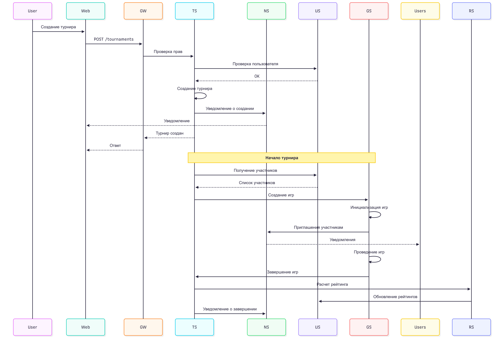
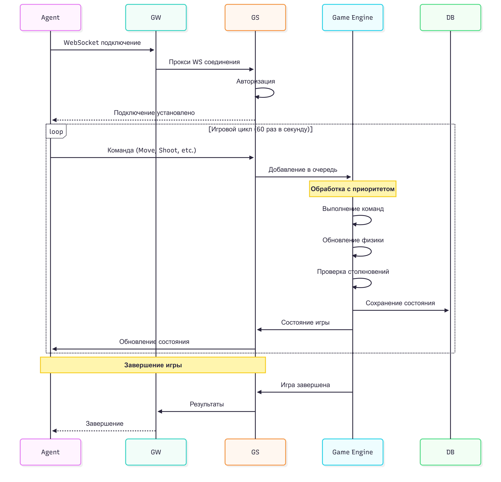

# 1. Диаграмма архитектуры
## Общая архитектура системы


## Детальная диаграмма взаимодействия микросервисов


## Диаграмма компонентов Game Service



# 2. Детальное описание микросервисов
## 2.1 API Gateway
**Назначение:** Единая точка входа для всех клиентов

**Функциональность:**
- Аутентификация и авторизация
- Маршрутизация запросов
- Ограничения пропускной способности
- Балансировка нагрузки
- Логирование и мониторинг

**Endpoints:**
```
/health - Health check
/auth/login - Вход
/auth/register - Регистрация
/auth/refresh - Обновление токена
/api/users/* - Прокси на User Service
/api/tournaments/* - Прокси на Tournament Service
/api/game/* - Прокси на Game Service
/api/rating/* - Прокси на Rating Service
/api/replay/* - Прокси на Replay Service
/ws/game/* - WebSocket прокси на Game Service
```


## 2.2 User Service
**Назначение:** Управление пользователями

**Функциональность:**
- Регистрация и аутентификация
- Управление профилями
- Хранение пользовательских данных
- Кэширование сессий

**Endpoints:**
```
POST /api/users/register - Регистрация
POST /api/users/login - Вход
GET /api/users/{id} - Получение профиля
PUT /api/users/{id} - Обновление профиля
GET /api/users/{id}/rating - Получение рейтинга
GET /api/users/{id}/history - История игр
```


## 2.3 Tournament Service
**Назначение:** Управление турнирами

**Функциональность:**
- Создание турниров
- Управление заявками
- Расписание турниров
- Отслеживание статуса турниров
- Расчет рейтинга турниров

**Endpoints:**
```
GET /api/tournaments - Список турниров
GET /api/tournaments/upcoming - Будущие турниры
GET /api/tournaments/{id} - Информация о турнире
POST /api/tournaments - Создание турнира
POST /api/tournaments/{id}/apply - Подача заявки
PUT /api/tournaments/{id}/status - Изменение статуса
GET /api/tournaments/{id}/results - Результаты
```

**База данных:** PostgreSQL


## 2.4 Game Service
**Назначение:** Основная игровая логика

**Функциональность:**
- Создание и управление игровыми сессиями
- Обработка команд от агентов
- Выполнение игровой физики
- Управление WebSocket соединениями
- Сохранение состояния игры

**Endpoints:**
```
POST /api/game/create - Создание игры
GET /api/game/{id}/state - Получение состояния игры
POST /api/game/{id}/command - Отправка команды (альтернатива WS)
GET /api/game/{id}/status - Статус игры
DELETE /api/game/{id} - Завершение игры
```

**WebSocket:**
```
/ws/game/{gameId} - Подключение к игре
```

**Компоненты:**
- Game Manager: Создание и управление играми
- Command Queue: Очередь команд с приоритетами
- Command Executor: Исполнение команд
- State Manager: Управление состоянием игры
- Physics Engine: Физика движения
- Collision Detector: Обнаружение столкновений

**База данных:** PostgreSQL + Redis (быстрое состояние)

## 2.5 Rating Service
**Назначение:** Управление рейтингами и статистикой

**Функциональность:**
- Расчет рейтингов
- Обновление статистики
- Таблицы лидеров
- Агрегация данных

**Endpoints:**
```
GET /api/rating/leaderboard - Таблица лидеров
GET /api/rating/users/{id} - Рейтинг пользователя
GET /api/rating/tournaments/{id} - Рейтинг турнира
POST /api/rating/calculate - Расчет рейтингов (внутренний)
```

**База данных:** PostgreSQL + Redis (для leaderboard)


## 2.6 Notification Service
**Назначение:** Отправка уведомлений пользователям

**Функциональность:**
- Email уведомления
- WebSocket уведомления
- Push уведомления
- Очередь уведомлений

**Endpoints:**
```
POST /api/notifications/send - Отправка уведомления
GET /api/notifications/user/{id} - Получение уведомлений
PUT /api/notifications/{id}/read - Отметка как прочитанное
```

**Типы уведомлений:**
- Приглашение на турнир
- Решение по заявке
- Начало боя (за 15 минут)
- Завершение боя
- Обновление рейтинга


# 3. Взаимодействие между микросервисами

## Синхронное взаимодействие (REST)


## Асинхронное взаимодействие (Message Queue)



# 4. Сценарии использования

## 4.1 Регистрация и вход пользователя


## 4.2 Создание и проведение турнира


## 4.3 Игровой процесс (Агент ↔ Game Service)



# 5. Узкие места и решения

| Компонент	| Проблема | Решение |
|--|--|
| Game Service |	Поддержка тысяч одновременных WebSocket соединений от агентов. Каждое соединение требует памяти и ресурсов CPU. | Connection Pool и балансировка |
| Game Service |	Обработка сотен игр одновременно, каждая с приемлемым FPS, множеством объектов и расчетами физики. | Многопоточность и асинхронность |
| Game Service |	Очередь команд может стать узким местом при высоких нагрузках | Батчинг |


# 6. Компоненты с часто меняющимися требованиями
| Компонент	| Частота изменений |Типичные изменения	| Стратегия OCP |
|--|--|
| Game Service |	Очень высокая |	Физика, столкновения, поведение |	Strategy Pattern |
| Tournament Service |	Высокая |	Форматы, правила расчета |	Strategy Pattern |
| Rating Service |	Средняя |	Алгоритмы расчета	| Strategy Pattern |
| Notification Service |	Высокая |	Типы, каналы доставки |	Factory Pattern |
| API	| Средняя |	Версионирование, форматы |	Versioning |


# 7. Конфигурация

Настройки приложения вынесены в переменные окружения с префиксом `SPACE_BATTLE_`
и/или файл `.env` в корне проекта (см. `.env.example`). Смена конфигурации не
требует правки исходного кода.

| Переменная | Описание | По умолчанию |
|--|--|--|
| `SPACE_BATTLE_SECRET_KEY` | Секретный ключ подписи JWT (одинаковый для обоих сервисов) | дефолтный из кода |
| `SPACE_BATTLE_ALGORITHM` | Алгоритм подписи JWT | `HS256` |
| `SPACE_BATTLE_GAME_SERVICE_HOST` | Хост Game Service | `0.0.0.0` |
| `SPACE_BATTLE_GAME_SERVICE_PORT` | Порт Game Service | `8001` |
| `SPACE_BATTLE_AUTH_SERVICE_HOST` | Хост Auth Service | `0.0.0.0` |
| `SPACE_BATTLE_AUTH_SERVICE_PORT` | Порт Auth Service | `8002` |
| `SPACE_BATTLE_TOKEN_EXPIRATION_SECONDS` | Срок жизни JWT-токена, секунды | `3600` |

> **ВАЖНО:** в продакшене всегда задавайте свой `SPACE_BATTLE_SECRET_KEY`.

Объект настроек доступен командам движка через IoC-зависимость `"Config"`,
зарегистрированную в прикладном скоупе (`initialize_application_scope()`
в `src/space_battle/core/scopes/app_scope.py`): `Ioc.resolve("Config", Settings)`.
